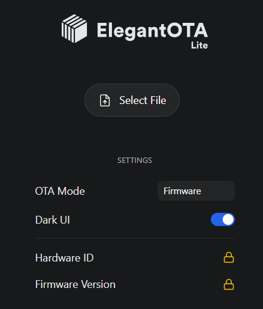

# Development Project Setup

## Environment Setup  
https://sg.cytron.io/tutorial/getting-started-with-esp32  

### Driver Installation
- Mine uses a CH340 USB Driver. This can be found printed on the chip but its hyper tiny. So the driver can be found here:
https://www.wch-ic.com/downloads/CH341SER_ZIP.html  
- Run setup.exe

### IDE
#### To use Arduino IDE
- Preferences > Settings > Additional Boards Manager URLs - enter https://raw.githubusercontent.com/espressif/arduino-esp32/gh-pages/package_esp32_index.json  
- Tools > Board: > Boards Manager > search for esp32 by Espressif systems & install
- Device Manager in Computer > Find the Port number for the Driver installed e.g. COM8
- In Arduino, Tools > Port > select Port 

#### But Actually, Use PlatformIO
- Install PlatformIO Extension in VS Code
- Change sketch.ino to main.cpp
Pros:
- Works with VS Code and other Dev boards. 
- Which means better functionality like u can F12 into API structs to see the raw code which really really helps, and all the goodness like proper folder explorer etc.

### OTA - Development Firmware Updating
Since we are using ElegantOTA, it writes to the default Arduino partitioning that already includes a small OTA partition.

A. Make a Build
1. Build in Release (esp32dev-release)
2. Find bin file in .pio/build/esp32dev-release/firmware.bin

B. Upload Build
1. Wait for Clock to display to signal that WiFi has gone through AP mode successfully.
2. Press OTA button to start OTA mode.
3. Go to browser e.g. 192.168.x.xx/update, the address is what we print from the WiFi connection.
4. Upload bin file

C. Checking for success
1. Device should flicker as it is uploading
2. Device should rebooot
3. After reboot, press the OTA button again. 
4. Going to 192.168.x.xx directly should print the version number currently installed, which should increment accordingly to the code.

