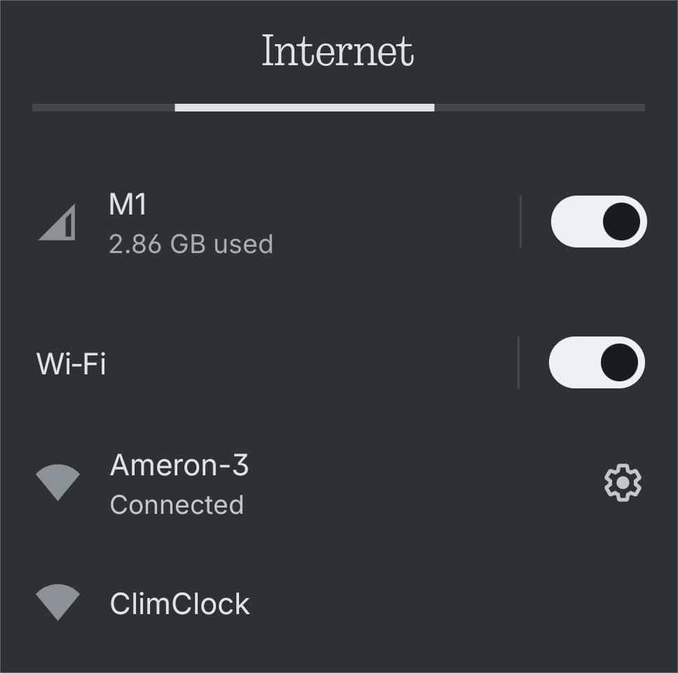
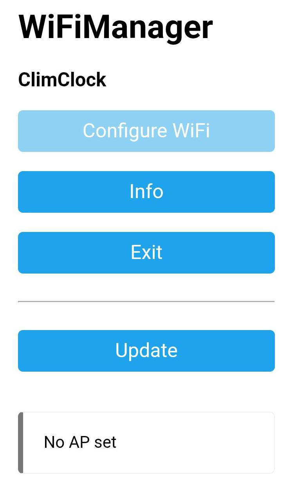

## Digital Clock

### About
This is a simple digital clock that uses a segment display to show time. Connects to Wifi to sync daily. 

### Environment
- PlatformIO with VSCode
- Using Arduino Environment
#### Libraries
- WiFiManager
- ElegantOTA

### Components
- ESP32 Wroom 32E (ESP32 Development Board CH340C)
- 4 Digit 7-Segment Display 5641AS, 4 x 330 Ohm Resistors
- Push button

### Personal Learning Points
- Working with ESP32 microcontroller.
- 4 digit 7 segment display.
- Basic big picture understanding of how Wifi, AP, RTC, and OTA works. But I still depend on libraries. 

### Connecting to Wifi
When first booting, nothing will display until Wifi is connected. To do so:
1. Go to your Wifi Network list on phone or PC, and find "ClimClock". Wait for a few seconds for it to appear.

2. Select Configure Wifi. Follow instructions given.

3. Wait a few seconds for time to sync.

Subsequent boots will remember the last Wifi configuration, unless it fails to connect.  
